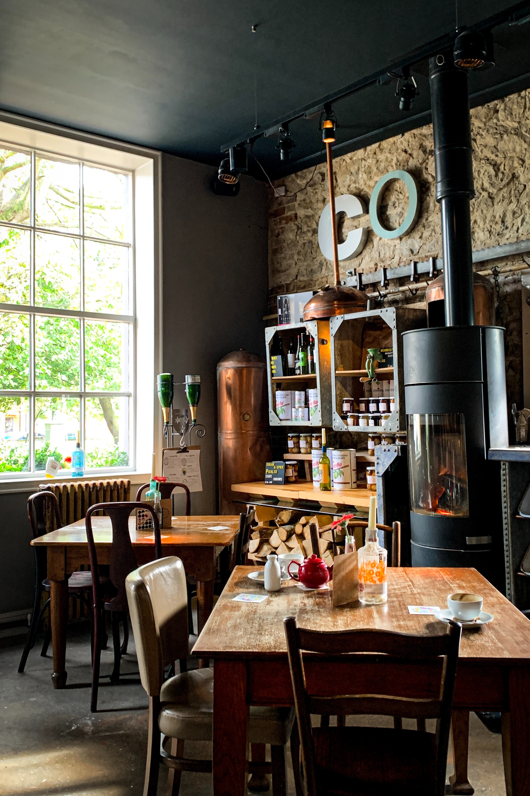

# Ulster Spring Coffee Shopにようこそ！

### （このサイトは、実習データをそれっぽく見せるための偽サイトです）

写真は [Rich Tervet](https://unsplash.com/@richtervet) 
from [UNSPLASH](https://unsplash.com/photos/QHdsm9kvKwI)

## 私たちについて

私たちのカフェはジャマイカのアルスタースプリングにあります。
私たち兄弟はジャマイカのブルー・アンド・ジョン・クロウ・マウンテンズ国立公園の近くの牧歌的な町アルスタースプリングで生まれ育ちました。

https://www.google.com/maps/place/Jamaica+ulster+spring/

アルスタースプリングコーヒーショップは、兄のKai Tabataが市内に設立した小さな喫茶店です。
高価なブルーマウンテン豆をブレンドして徐々に地元の人に愛されるようになったコーヒー。
2020年11月、ジャマイカのトレレーブ教区とシーボードストリートを楽しみたいという私たちの願いに応えて、新しい小さなショップを開きました。
私たちは非常に新しい店にいます。美味しくするために時間と労力を要する飲み物を作ります。ジャマイカで愛されている料理も楽しめます。

https://www.google.com/maps/place/Jamaica+trelawny+parish/

https://www.google.com/maps/place/Jamaica+Falmouth+Seaboard+st/

## もうすぐ日本のみんなに会います

当店は、2021年10月に日本の仙台駅の近くにジャマイカ以外の国で初めてオープンします。
アルスタースプリングに生まれ、地元の人々に愛されています。日本のみんなに大好きなコーヒーを早く
楽しんでもらいたいです。

